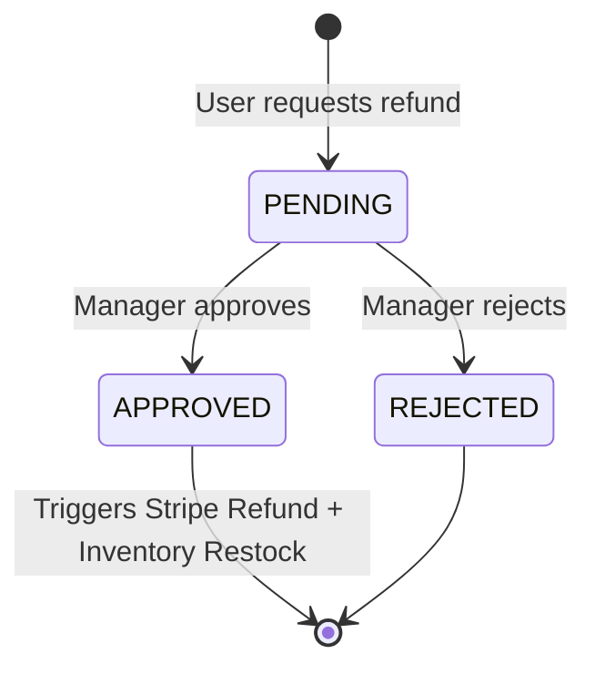

# E-Commerce Refund Architecture

## Overview
The Refund system allows buyers to request their money back for orders that are already `PAID`, `SHIPPED`, or `DELIVERED`. It incorporates a dual-role approval workflow where a Manager must manually approve or reject the refund request before any money is disbursed via the Stripe API.

## Core Entities
1. **RefundRequest**: A new domain model tracking the user's intention to refund an order.
2. **Order**: State machine updated to support a new `REFUNDED` status.
3. **Payment**: Already supports `REFUNDED` status.

### RefundRequest Lifecycle

## Use Cases

### 1. RequestRefundUseCase (User Role)
- **Actor**: `CLIENT`
- **Pre-conditions**: The order must belong to the user and its status must be `PAID`, `SHIPPED`, or `DELIVERED`.
- **Action**: Creates a `RefundRequest` with a `reason` and status `PENDING`.
- **Post-conditions**: A `RefundRequestCreatedEvent` is published (can trigger an email to the Manager).

### 2. ApproveRefundUseCase (Manager Role)
- **Actor**: `MANAGER`
- **Pre-conditions**: The `RefundRequest` is `PENDING`.
- **Action**: 
  1. Retrieves the Payment Intent associated with the Order.
  2. Calls the `StripeService.refundPayment(intentId)`.
  3. Marks the `Payment` as `REFUNDED`.
  4. Marks the `RefundRequest` as `APPROVED`.
  5. Marks the `Order` as `REFUNDED`.
  6. Restocks the inventory of the products.
- **Post-conditions**: A `RefundApprovedEvent` is published (triggers an email to the User with the good news).

### 3. RejectRefundUseCase (Manager Role)
- **Actor**: `MANAGER`
- **Pre-conditions**: The `RefundRequest` is `PENDING`.
- **Action**: Marks the `RefundRequest` as `REJECTED` (with an optional explanation note).
- **Post-conditions**: A `RefundRejectedEvent` is published (triggers an email to the User explaining why it was denied).

## Events
- `RefundRequestedEvent`
- `RefundApprovedEvent`
- `RefundRejectedEvent`

## Third-Party Integrations
- **Stripe API**: We natively use the `Refund.create` method from the Stripe SDK using the initial Payment Intent ID stored in our database.
- **Resend (Email)**: Email notifications are asynchronously sent reacting to the domain events to keep the user informed of the Return lifecycle.
